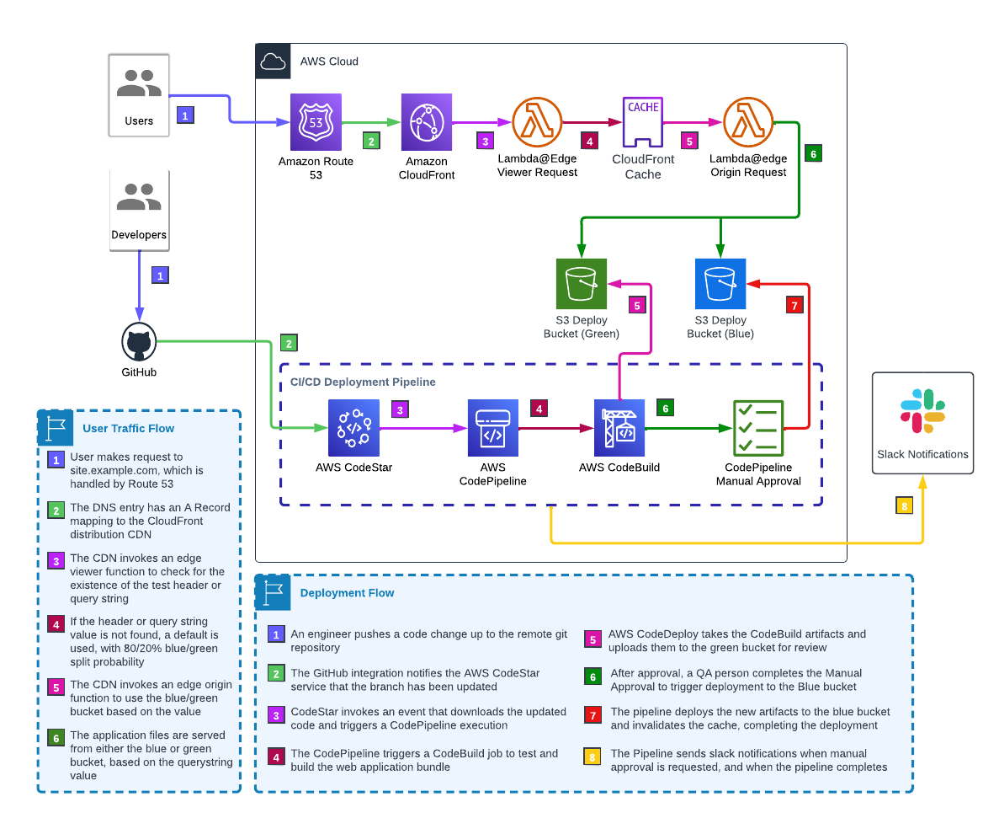

# Website Pipeline Infrastructure Project

This is a project for CDK development with TypeScript. It is used for deploying a web page with a Blue/Green pipeline. The React project lives in the root directory and the CDK project lives in the `./infra` subdirectory as an independent node.js project.

It depends on the following resources being available:

- A GitHub repo with these contents
- A CodeStar connection to GitHub
  - This triggers the build when branches are pushed
- An environment variable file (`.env`) with the following contents:
  - CODESTAR_ARN
  - DOMAIN_NAME
  - GITHUB_OWNER
  - GITHUB_REPO
  - SERVICE_NAME
  - SLACK_WORKSPACE_ID (optional)
  - SLACK_CHANNEL_ID (optional)
  - See `.env.example` for an example you can copy/paste

## Architecture

## Deployment

The app is deployed to an environment, which maps to a combination of the following

- An AWS Account
- An AWS region (e.g. "us-east-1")
- A `$CDK_ENV` environment (e.g. "dev")

There exists a mapping between the `$CDK_ENV` and the git branch containing the code that will be deployed. Currently there are two mappings:

- `$CDK_ENV` == 'dev' - GitHub branch 'dev'
- `$CDK_ENV` == 'prod' - GitHub branch 'main'

You may add as many mappings as you like, and setting the `$CDK_ENV` environment variable before initial deployment will set the pipeline to automatically deploy the mapped branch on update. You can create additional mappings, e.g.

- `$CDK_ENV` == 'test' - GitHub branch 'test'
- `$CDK_ENV` == 'pdamra' - GitHub branch 'pdamra'

## Deployment Stages

### Stage 1: Source

This stage is triggered by GitHub upon a push. When triggered, it downloads the most recent version of the configured branch and packages it as an input artifact for the pipeline.

#### CodeStar Connection Setup

- AWS Management Console -> CodePipeline -> Settings -> Connections -> Create Connection
- Select provider (GitHub)
- Connection Name (e.g. DevAccountGitHubConnection)
- "Install a new app"
- Authenticate with GitHub
- Select the repo to connect (returns you to AWS)
- "Connect"

### Stage 2: Build

This stage is a CodeBuild project that executes the steps needed to build the website, e.g.

- `npm ci`
- `npm test`
- `npm run build`
- Any other shell commands you need to make the deployment bundle

When the build is completed successfully, the bundled files are collected into an output artifact.

### Stage 3: Deploy Green

This stage deploys the green side of the S3 origin. It takes the output artifact and copies the files to the green bucket. It then invalidates the CloudFront cache for the green bucket so that the new files can be served to users who are targeted as "green". Finally, it pauses pipeline execution until a manual approval process is complete.

### Stage 4: Deploy Blue

Once the acceptance testing on the green version is successful, an engineer can click the "Review" button on the CodePipeline console, and then click "Approve". This will trigger a deployment to the green bucket. Once the new files are written to the bucket, the cache is again invalidated, and the new files are served to all users.

## Testing / Selecting Blue or Green

By default, web requests are randomly assigned to the green or blue S3 origin bucket. The assignment logic is that a request has an 80% chance of being directed to the blue bucket.

HOWEVER, it is possible to manually select blue or green by passing a header in the HTTP request. This can be accomplished with tools like the ModHeader Chrome browser extension.

The header used to route traffic manually to green or blue is `x-blue-green-context`. If this header is added to the request with a value of "`green`" or "`blue`", the request will be routed to the corresponding bucket.

### Testing Workflow

1. A deployment is triggered by a push to GitHub
2. When the deployment to the green bucket is complete, the pipeline pauses, waiting for manual approval
3. The tester would then use the ModHeader Chrome browser extension to add the header `x-blue-green-context` with a value of "`green`"
4. Now the tester will see the new version of the site when they visit the URL (may need to clear local cache)
5. If problems are found, the steps 1-4 can be repeated
6. Once approved, the tester clicks the "Review" button in the CodePipeline console, and the new files are deployed to the green bucket, and displayed to all users

## Pipeline Event Notifications

If the `SLACK_WORKSPACE_ID` AND `SLACK_CHANNEL_ID` environment variables are provided, a `SlackChannelConfiguration` resource and `NotificationRule` will be created and assigned to the pipeline using an AWS ChatBot Client application.

### Chatbot Client Setup

These steps must be completed before attempting to set up notifications using this stack.

- https://console.aws.amazon.com/chatbot/
- Configure a chat client -> Slack -> Configure Client
  - Redirects to Slack OAuth screen -> Allow
- On Workspace Details page, you'll be presented with options:
  - Configure new channel
  - Create configuration using CloudFormation templates
- We will define in CDK in this stack
- Add workspace ID and slack channel ID to .env file
  - Workspace ID on Workspace Details page
  - Channel ID in Slack, in dropdown menu under #channelname heading up top
- Add a `SlackChannelConfiguration` to the stack
- Add an SNS `Topic` to the stack
- Add the topic to the `notificationTopics` property of the configuration
- In the slack channel, invite `@aws`
- In AWS Chatbot console -> Configured Clients -> Slack Workspace: my-project or whatever
  - Select "Send test message"
- Did it come through? I bet it did!

# CDK - The AWS Cloud Development Kit

The `cdk.json` file tells the CDK Toolkit how to execute your app.

## Useful commands

- `npm run build` compile typescript to js
- `npm run watch` watch for changes and compile
- `npm run test` perform the jest unit tests
- `cdk deploy` deploy this stack to your default AWS account/region
- `cdk diff` compare deployed stack with current state
- `cdk synth` emits the synthesized CloudFormation template

# Getting Started with Create React App

This project was bootstrapped with [Create React App](https://github.com/facebook/create-react-app), using the [Redux](https://redux.js.org/) and [Redux Toolkit](https://redux-toolkit.js.org/) TS template.

## Available Scripts

In the project directory, you can run:

### `npm start`

Runs the app in the development mode.\
Open [http://localhost:3000](http://localhost:3000) to view it in the browser.

The page will reload if you make edits.\
You will also see any lint errors in the console.

### `npm test`

Launches the test runner in the interactive watch mode.\
See the section about [running tests](https://facebook.github.io/create-react-app/docs/running-tests) for more information.

### `npm run build`

Builds the app for production to the `build` folder.\
It correctly bundles React in production mode and optimizes the build for the best performance.

The build is minified and the filenames include the hashes.\
Your app is ready to be deployed!

See the section about [deployment](https://facebook.github.io/create-react-app/docs/deployment) for more information.

### `npm run eject`

**Note: this is a one-way operation. Once you `eject`, you can’t go back!**

If you aren’t satisfied with the build tool and configuration choices, you can `eject` at any time. This command will remove the single build dependency from your project.

Instead, it will copy all the configuration files and the transitive dependencies (webpack, Babel, ESLint, etc) right into your project so you have full control over them. All of the commands except `eject` will still work, but they will point to the copied scripts so you can tweak them. At this point you’re on your own.

You don’t have to ever use `eject`. The curated feature set is suitable for small and middle deployments, and you shouldn’t feel obligated to use this feature. However we understand that this tool wouldn’t be useful if you couldn’t customize it when you are ready for it.

## Learn More

You can learn more in the [Create React App documentation](https://facebook.github.io/create-react-app/docs/getting-started).

To learn React, check out the [React documentation](https://reactjs.org/).
